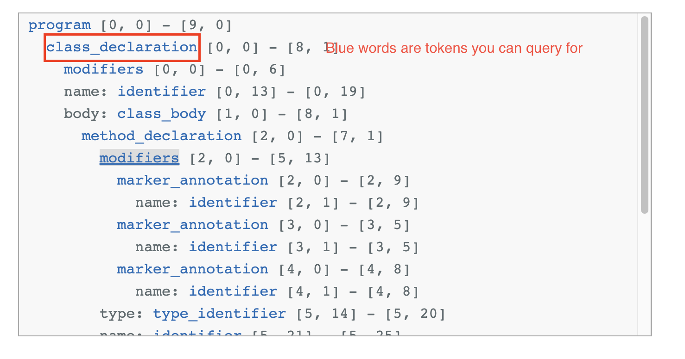

# Setup
`docker build -t securelink:latest .`

# Usage
* Add your java linting rule in rules/java-rules.txt
    * Make sure to add comment above query rule with leading semicolon e.g. `; Catch Intellij NotNull or Nullable annotations` 
* mount inputs files in a inputs directory

Note: if adding new query rule, you have to rebuild container.
```
chmod u+x query.sh
./query.sh <code directory> <file paths to query>...
```

```./query.sh /Users/afloresescarcega/REPOS/parent/ '/Users/afloresescarcega/REPOS/parent/**/*.java'```


## Debugging query example
`docker run -it --entrypoint=/bin/bash securelint:latest`
`tree-sitter query 'rules/java-rules.txt' 'some-file.java'`

# Crafting a parser
Very quick tips to get you started

This is the interactive playground to get you going fast testing a query. Make sure to "ticket" query mode.
https://tree-sitter.github.io/tree-sitter/playground


Queries are like code-aware greps! But, it's not regex!

`((marker_annotation)@capture1 (#match? @capture1 "Nullable|NotNull"))`

marker_annotation is a token you would use to create a capture. You can write rules, like match regex string, on tokens you capture.



To learn more, visit https://tree-sitter.github.io/tree-sitter/creating-parsers
